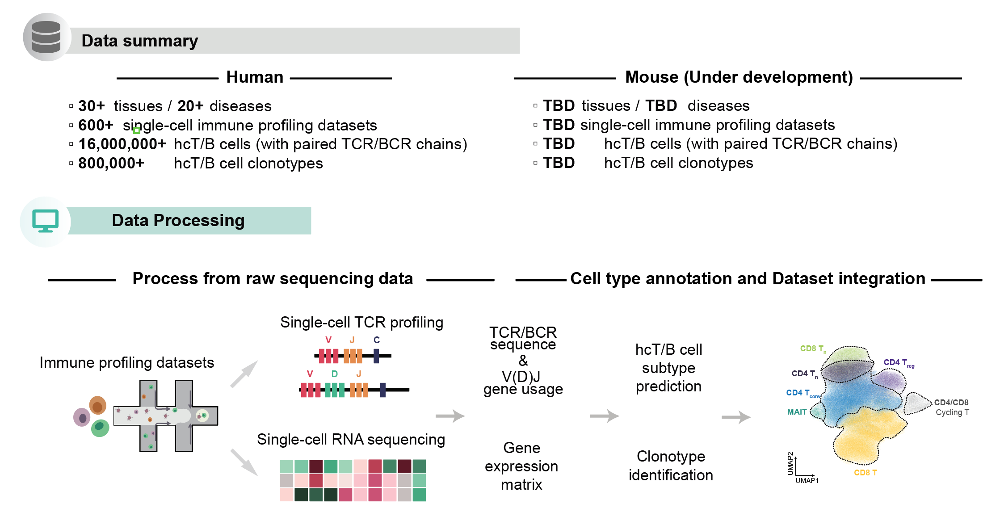

# TCR-DeepInsight

## Aims

We have previously developed [huARdb](https://huarc.net/v2/) currently in developing which collects single-cells immune profiling datasets including linked transcriptome and full-length TCR informations. However, one of the main obstacles in using single-cell immune profiling datasets for disease immunotherapy is the absence of a convenient reference atlas to access this information. Despite the growing potential of TCR engineering in this area, there is a significant challenge in identifying functional TCRs due to the lack of efficient computational tools to integrate the data. Nonetheless, these datasets offer a valuable resource to identify such TCRs and further advance TCR-T technology.



### Detailed collection of datasets

We aims to build the most comprehensive atlas containing matched transcriptome and full-length V(D)J sequence of T and B cells in **Cancer**, **Autoimmune diseases**, and **Infections**. 


- In 2023, we make the first release of an integrated datasets containing more than 1,000,000 hcT cells with full length TCR sequence.
- In 2024, we will release the second version of the atlas with more than 20,000,000 hcT cells with full length TCR sequence, which is available at [Zenodo](https://zenodo.org/uploads/12176396).


## Introduction to TCR-DeepInsight

To robustly identify potential disease associated TCRα/β pairs considering both TCR sequence similarity and transcriptome features from million-level paired TCRα/β repertoire, we developed a deep-learning based framework named TCR-DeepInsight. 

## Documentation 

The documentation for TCR-DeepInsight is available at [ReadTheDocs](https://tcr-deepinsight.readthedocs.io/en/latest/index.html).

## Installation


**Hardware requirement for TCR-DeepInsight includes**
1. RAM: >16Gb for larger dataset
2. VRAM of CUDA-enabled GPU: >8Gb 

### Install by PyPI

```shell
pip install tcr-deep-insight
```

### Install by source code


You can create a running environment using `conda` ([Anaconda](https://www.anaconda.com/download#Downloads) or [Miniconda](https://docs.conda.io/en/main/miniconda.html))

```shell
conda create -n tcr-deep-insight -f environment.yml
conda activate tcr-deep-insight
git clone git@github.com:WanluLiuLab/TCR-DeepInsight.git
cd TCR-DeepInsight
```

### Install alternative pytorch version

Please see the [PyTorch official website](https://pytorch.org/) for installing GPU-enabled version of PyTorch.

```python
# Testing if CUDA is available
import torch
print(torch.__version__)
print(torch.cuda.is_available())
```

TCR-DeepInsight was tested on PyTorch 1.13.1 and CUDA 11.7

## Usage


In IPython, simply import the package to get started:


```python
import tcr_deep_insight as tdi 
```

For detailed usage, Please see the [Documentation for TCR-DeepInsight](https://tcr-deepinsight.readthedocs.io/en/latest/index.html).

## License

This project is licensed under the BSD 3-Clause License.