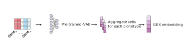
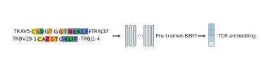
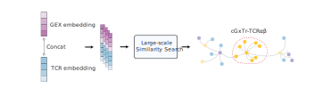

Introduction
============

The emergence of single-cell immune profiling technology has led to the production of a large amount of data on **single-cell gene expression (GEX)** and **T cell receptor (TCR)**, which has great potential for studying TCR biology and identifying effective TCRs. However, one of the major challenges is the lack of a reference atlas that provides easy access to these datasets. On the other hand, the use of TCR engineering in disease immunotherapy is rapidly advancing, and single-cell immune profiling data can be a valuable resource for identifying functional TCRs. Previous approaches like ConGA :cite:`Schattgen2021`, Tessa :cite:`Zhang2021` and mvTCR :cite:`Drost2024` Nevertheless, the lack of efficient computational tools to integrate and identify functional TCRs is a significant obstacle in this field.

To robustly identify potential disease associated TCRαβ clonotypes considering both TCR sequence similarity and transcriptome features from population-level scRNA-seq data, we leverage our previously established `huARdb <https://huarc.net/v2/>`_ :cite:`Wu2022` database and develop a computational tool, TCR-DeepInsight, to integrate TCR and GEX information and identify potential disease associated TCRαβ clonotypes with convergene gene expression profile and TCR sequence (cGxTr-TCRαβ).

Rationale
---------

For large-scale and heterogeneous scRNA-seq gene expression (GEX) data, we use an Variational Autoencoder (VAE) based model, `scAtlasVAE <https://scatlasvae.readthedocs.io/>`_, to capture the biological signal and regress out technical or biological batch efffects.

For full-length TCR repertoire data, we use a transformer-based model, BERT, to learn the TCR sequence features and TCR sequence similarity. 
We use the CDR1α, CDR2α, CDR3α, CDR1β, CDR2β, and CDR3β to represent the TCR sequence features. 

By concatenating the TCR sequence features and the GEX features, we use a faiss-based similarity search to identify the potential disease associated TCRαβ clonotypes 
with convergene gene expression profile and TCR sequence (cGxTr-TCRαβ), accelerated by GPU computing.

The Euclidean distance is used to measure the similarity of TCR and GEX features within a TCR cluster.

.. math::

   \mathrm{TrGx}_{\mathrm{Distance}}(\bf{s_i},\bf{s_j})=\mathrm{EuclideanDistance}(\mathrm{TrGx}(\bf{s_i}),\mathrm{TrGx}(\bf{s_j}))

We defined a TCR/GEX (TrGx) convergence score to measure the similarity of GEX and TCR within a TCR cluster. 

.. math::

   \mathrm{TrGx}_{\mathrm{Convergence}}=\frac{\sum_{i=1}^n \mathrm{TrGx}_{\mathrm{Distance}}(\bf{s_i},\bf{s_{\mathrm{anchor}}})}{n}

We also defined a disease-association score to measure the disease association of a TCR cluster.

.. math::

   \mathrm{TrGx}_{\mathrm{Disease-association}}=\frac{\sum_{j=1}^m \mathrm{TrGx}_{\mathrm{Distance}}(\bf{s}_j,\bf{s_{\mathrm{anchor}}})-\sum_{i=1}^n \mathrm{TrGx}_{\mathrm{Distance}}(\bf{s}_i,\bf{s_{\mathrm{anchor}}})}{n+1}

Dataset
-------

We use the huARdb atlas v2.5 datasets containing 2,298,878 GEX cells with 1,450,512 TCRαβ clonotypes.

Which is available at `Zenodo <https://zenodo.org/records/12741480>`_.

Update Plan  
-----------

Change log
~~~~~~~~~~

- v1.0.2
  - Add permutation test to `tcr_deep_insight.tl.cluster_tcr` and `cluster_tcr_from_reference` to determine the significance of the TCR clusters.
